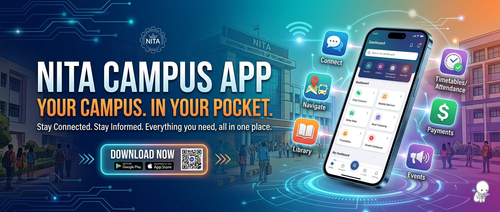
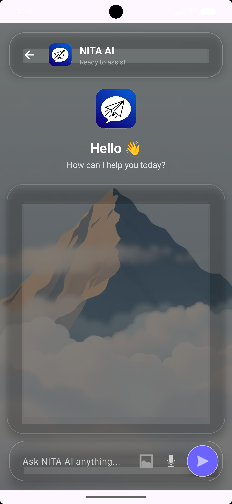

# 🎓 NITA Campus

NITA Campus is a modern Android application developed for students of **NIT Agartala**. The app serves as a centralized platform where students can access academic resources, explore department information, communicate with peers, and utilize AI-powered assistance—all within a single application.

---

## 🚀 Features

### 🔐 Authentication
- Secure Sign Up and Sign In using Firebase Authentication
- User account management

### 📊 Student Dashboard
- Modern and intuitive user interface
- Quick access to academic and campus resources
- Easy navigation across modules

### 🤖 AI Assistant
- Integrated AI-powered assistant
- Helps students with academic and campus-related queries

### 📚 Academic Resources
- Subject-wise study materials
- Notes and learning resources
- Previous Year Questions (PYQs)

### 🏛 Department Information
- Computer Science & Engineering
- Electronics & Communication Engineering
- Electrical Engineering
- Mechanical Engineering
- Civil Engineering
- Chemical Engineering
- Production Engineering
- Instrumentation Engineering

### 🎯 Campus Information
- Events and activities
- Student clubs
- Faculty information
- Scholarship details
- Campus facilities

---

## 🛠 Tech Stack

- Kotlin
- Android SDK
- Firebase Authentication
- Firebase Realtime Database
- Gemini AI API
- RecyclerView
- View Binding
- Material Design Components

---

## 🏗 Project Structure

The application follows a modular Android architecture with separate components for:

- Authentication
- Dashboard Management
- Academic Resources
- Department Information
- AI Assistant
- User Profiles
- Navigation Management

---

## 💡 Skills Demonstrated

- Android Application Development
- Kotlin Programming
- Firebase Integration
- Authentication Systems
- Real-Time Database Management
- API Integration
- UI/UX Design
- RecyclerView Implementation
- Navigation Drawer Implementation
- Problem Solving & Debugging

---

## 📸 Screenshots

<p align="center">
  
  
  
</p>

<p align="center">
  
  
  
</p>

---

## 🔮 Future Improvements

- Push Notifications (FCM)
- Dark Mode Support
- Attendance Tracking
- Timetable Management
- Placement Preparation Module
- Faculty-Student Communication Portal
- Cloud Firestore Migration
- Offline Support
- MVVM Architecture
- Room Database Integration

---

## ⚙ Installation

1. Clone the repository

```bash
git clone https://github.com/pratikbhowal63-bot/NITA_Campus.git
```

2. Open the project in Android Studio

3. Add your own Firebase configuration file:

```text
app/google-services.json
```

4. Sync Gradle dependencies

5. Build and run the application

---

## 👨‍💻 Author

**Pratik Bhowal**  
B.Tech, Computer Science & Engineering  
National Institute of Technology Agartala

---

⭐ If you found this project useful, consider giving it a star.
