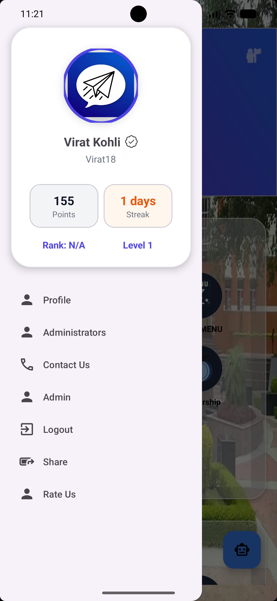
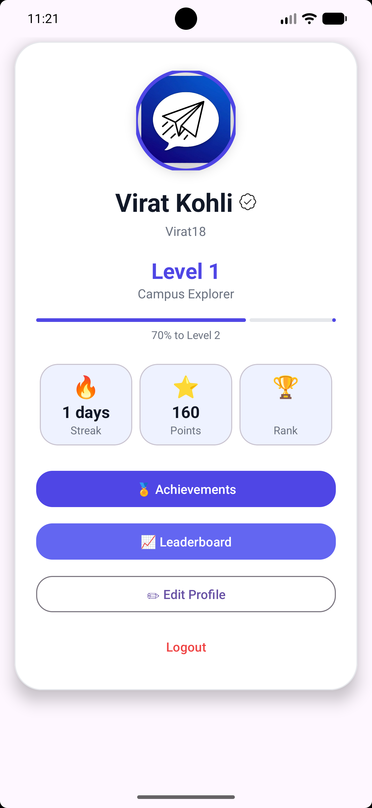

NITA Campus

NITA Campus is an Android application developed for students of NIT Agartala. The app serves as a centralized platform where students can access academic resources, communicate with peers, explore department information, and use AI-powered assistance within a single application.

Features

Authentication

* Secure Sign Up and Sign In using Firebase Authentication
* User account management

Student Dashboard

* Modern and user-friendly interface
* Quick access to academic and campus resources

AI Assistant

* Integrated AI-powered assistant
* Helps students with academic and campus-related queries

Academic Resources

* Subject-wise materials
* Notes and study resources
* Previous Year Questions (PYQs)

Department Information

* Computer Science & Engineering
* Electronics & Communication Engineering
* Electrical Engineering
* Mechanical Engineering
* Civil Engineering
* Chemical Engineering
* Production Engineering
* Instrumentation Engineering

Campus Information

* Events
* Clubs
* Faculty details
* Scholarship information
* Campus facilities

Project Structure

The application follows a modular Android architecture with separate activities for authentication, dashboard management, chat functionality, academic resources, department information, and AI-powered assistance.

Skills Demonstrated

* Android App Development
* Kotlin Programming
* Firebase Integration
* Authentication Systems
* Real-Time Database Management
* API Integration
* UI/UX Design
* RecyclerView Implementation
* Navigation Drawer Implementation
* Problem Solving and Debugging

Future Improvements

* Push Notifications
* Dark Mode Support
* Attendance Tracking
* Timetable Management
* Placement Preparation Module
* Faculty-Student Communication Portal
* Cloud Firestore Migration
* Offline Support

Author 

Pratik Bhowal

B.Tech, Computer Science & Engineering
National Institute of Technology Agartala

## 📸 Screenshots

### Login

### Dashboard

### Profile

### AI Assistant

